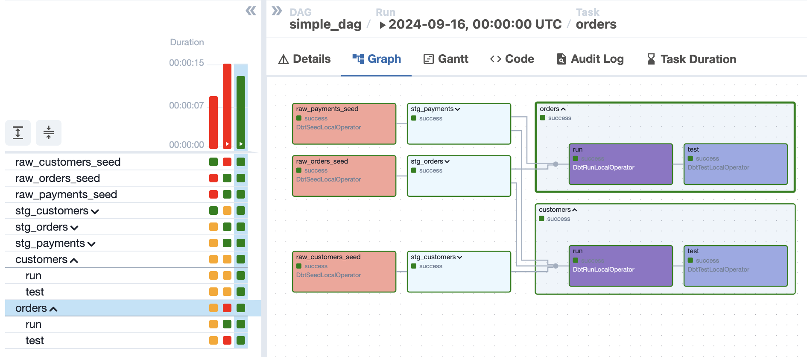
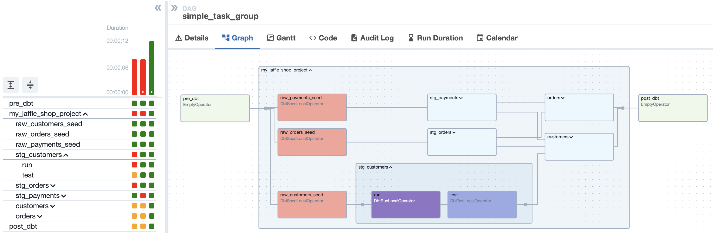
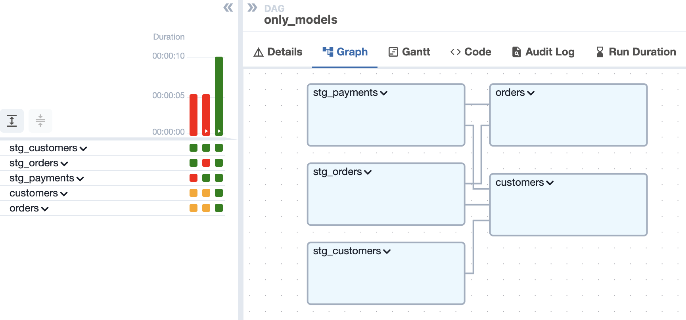

# Aiflow Schedule lab - with Cosmos
In this lab I loaded data from files into PostgreSQL and tested some ways to schedule using Airflow (Astro) with Cosmos

This repo contains a dbt project and a set of Airflow DAGs showing how to run dbt in Airflow using [Cosmos](https://github.com/astronomer/astronomer-cosmos).

To run this, you'll need:

- [The Astro CLI installed](https://docs.astronomer.io/astro/cli/overview)
- Docker

## Setup

1. Clone this repo
2. Configure .env file
2. Run `astro dev start` to start the Airflow instance

## The DAGs

The DAGs in this repo are meant to illustrate how to run dbt in Airflow using Cosmos. They use dbt's jaffle_shop example project.

The DAGs fall into three categories:

- Basic: these are the simplest examples of Cosmos  
They are very simple to implement, but they are perfect.

If you need group using tags (my favorite)

- Profiles: these show how to customize your dbt profiles using Cosmos

- Filtering: these show how to use Cosmos to filter which models are run

